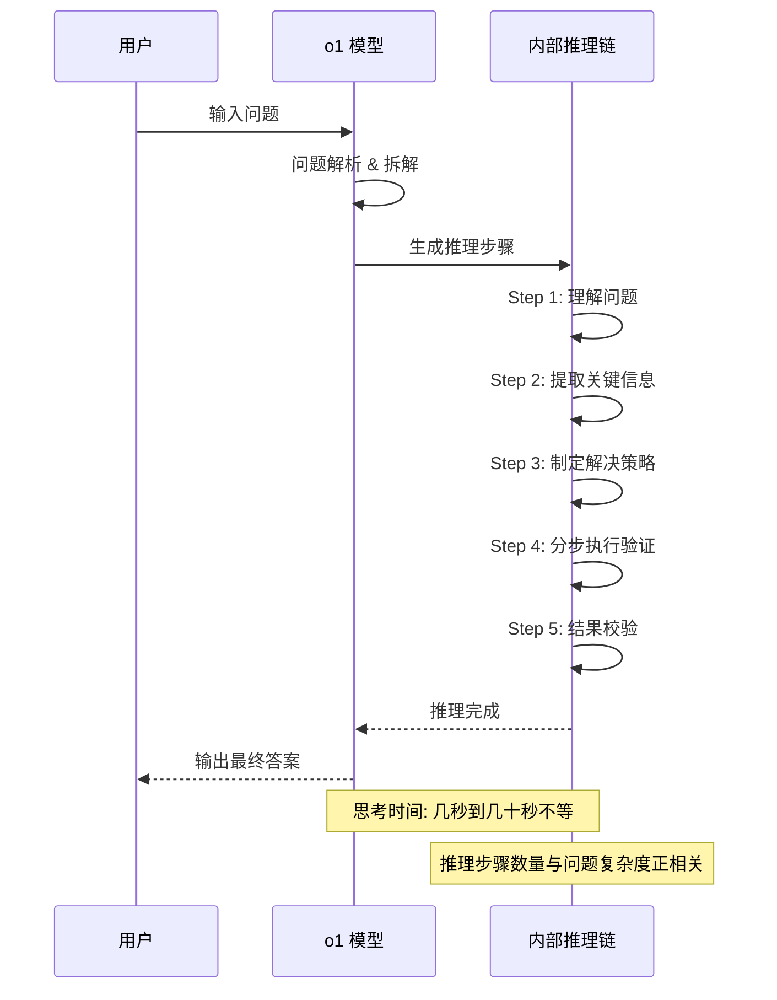

# 探索 OpenAI o1 模型

2025 年 2 月，传说中的 o1 终于体验到了。

说实话，之前看宣传说是能"思考"的模型，我还以为是营销噱头。毕竟 GPT-4 已经很强了，还能强到哪去？结果被打脸了。

## o1 到底是什么

o1 是 OpenAI 的新模型系列，主打**推理能力**。和之前的 GPT 系列完全是两条路线。

简单说：
- **GPT-4**：快思考模式，像直觉反应，给你一个快速的回答
- **o1**：慢思考模式，像深度思考，会自己推理很久

官方说法是 o1 在回答问题前会"内省"很久，把问题拆解成一步步推理。这点上确实和人类解决问题的方式有点像——遇到难题时会想一会儿，而不是立刻给出答案。

## 花了几天深度体验

这周有空，我专门拿 o1 做了不少测试。有惊喜也有坑，总结一下分享给大家。

### 数学问题测试

先拿经典的算法题试试水：

> 一个数组，除了一个元素外其他都出现了两次，找出那个唯一出现一次的元素  
> 比如：[1, 2, 3, 1, 2]

我寻思这题也不难，但想看看 o1 会怎么思考。结果它给我来了一套异或运算的思路：

- 相同数字异或为 0
- 0 与任何数异或等于该数
- 所有数字异或一遍，出现两次的都消掉了，剩下就是答案

然后给出了代码实现。关键是从思考到写代码，一气呵成，完全不需要我提示"用异或"。

接着我又试了一道更有难度的：

> 证明：如果 n 是完全数，那么 2^(n-1) * (2^n - 1) 是完全数

这题丢给 GPT-4，十有八九会开始胡扯。但 o1 真的在"思考"——不是立刻回答，而是先分析已知条件，再一步步推导。给出的证明逻辑是完整的，甚至知道引用欧几里得的完全数公式。

**实测结论**：数学推理能力确实强，尤其是需要多步推导的题目。

### 编程问题测试

算法题是 o1 的强项。我让它实现几种排序算法，结果都正确，而且会主动分析时间复杂度。

但我注意到一个问题：它写代码的速度比 GPT-4 慢很多。因为它会先"想"一会儿，有时候等半天。

```python
# 快速排序示例
def quicksort(arr):
    if len(arr) <= 1:
        return arr
    pivot = arr[len(arr) // 2]
    left = [x for x in arr if x < pivot]
    middle = [x for x in arr if x == pivot]
    right = [x for x in arr if x > pivot]
    return quicksort(left) + middle + quicksort(right)
```

不过这里有个坑：o1 目前不支持 system prompt！这意味着你没法像调教 GPT-4 那样，给它设定一个角色或风格。它就是它，有自己的脾性。

### 逻辑推理测试

再试试经典的逻辑题：

> 三位老师：张老师、李老师、王老师  
> 分别教语文、数学、英语  
> 已知：  
> - 张老师教语文  
> - 李老师教数学  
> - 王老师教英语  
> - 张老师和李老师是邻居  
> 问：谁教数学？

这道题太简单了，答案一目了然。但我加了难度：

> 五位科学家来自不同国家，喜欢不同饮料，从事不同研究  
> - 英国人住红房子  
> ...（省略中间条件）  
> 谁养鱼？

这种类型的题目，GPT-4 有时候会推理到一半出错，或者漏掉某个条件。o1 的表现更稳健，会把所有条件都列出来，然后逐一验证。

### 尝试学术论文阅读

本着"来都来了"的心态，我丢了一篇 AI 领域的论文给 o1 summarization 让它读。意想不到的是，它不仅能总结核心观点，还能指出论文中某些推导的潜在问题。

当然，这里有私心：我想看看它能不能帮我理解一些难懂的公式。结果它真的把公式拆解了一遍，虽然不是 100% 准确，但至少给了我一个理解的切入口。

## 和其他模型对比

光说 o1 多强可能没什么概念，我拿它和现在主流的几个模型做了对比：

| 维度 | o1 | GPT-4 | Claude 3.5 |
|------|-----|-------|------------|
| 数学推理 | ★★★★★ | ★★★ | ★★★ |
| 代码能力 | ★★★★ | ★★★★ | ★★★★ |
| 创意写作 | ★★ | ★★★★★ | ★★★★★ |
| 响应速度 | ★★ | ★★★★★ | ★★★★★ |
| 多轮对话 | ★★★ | ★★★★★ | ★★★★★ |
| 系统提示词 | ✗ | ✓ | ✓ |

**个人感受**：
- 数学和逻辑类问题：o1 > GPT-4 ≈ Claude
- 日常问答和聊天：GPT-4 > Claude > o1
- 写文章做内容：Claude 最强，GPT-4 次之，o1 有点无聊

o1 写出来的东西就是太"理性"了，缺乏灵魂。你让它写篇小说，它给你写得像说明书。

## o1 的推理过程（时序图）

官方说 o1 会"思考"，那它到底是怎么思考的？结合我的测试经验和官方资料，我画了个简单的流程图：



简单说就是：**理解问题 → 拆解问题 → 逐步推理 → 验证结果 → 输出答案**。这个过程对人类来说很自然，但之前的 LLM 做不到。

## 适用场景分析

### ✅ 适合用 o1 的场景

1. **数学证明和计算**：需要多步推导的数学题，o1 表现优异
2. **算法和编程**：尤其是需要思考的算法题，不是简单的 CRUD
3. **逻辑推理**：复杂的逻辑分析、侦探类问题
4. **学术研究**：读论文、推导公式、验证假设
5. **复杂问题分析**：需要拆解成多个子问题的情况

### ❌ 不适合用 o1 的场景

1. **创意写作**：写小说、写诗，o1 写出来的太机械
2. **简单问答**：问天气、问时间，用 o1 就是浪费
3. **需要快速响应**：等它思考半天，黄花菜都凉了
4. **闲聊对话**：没有灵魂的对话伙伴
5. **格式化输出**：写报告、写邮件，GPT-4 和 Claude 更灵活

## 缺点说说

### 1. 贵

o1 的价格是 GPT-4 的 3 倍左右。具体记不清了，但确实肉疼。每次用它解决问题，都感觉在烧钱。

### 2. 慢

思考时间从几秒到几十秒不等。急性子的人可能会疯。我有时候等不及，就切回 GPT-4 了。

### 3. 不支持系统提示词

这点很烦。你没法让它扮演一个角色，也没法设定输出风格。它就是它。

### 4. 输出有时过于冗长

可能是因为推理过程复杂，o1 有时候会给出非常详细的回答。简单问题复杂化，让人哭笑不得。

### 5. 无法记忆对话

每次对话都是独立的，不会有上下文的连续性。这点不如 GPT-4。

## 到底要不要用 o1

我的结论是：**不是替代，是互补**。

o1 和 GPT-4 是两个维度的模型。GPT-4 像是博学多才的顾问，什么都能聊，什么都能写。o1 像是专注解题的理工男，数学和逻辑超强，但其他方面差点意思。

**我的使用策略**：
- 日常问题、聊天、写作 → GPT-4 或 Claude
- 数学题、算法题、逻辑推理 → o1
- 复杂问题需要思考的 → 先问 o1，再问 GPT-4 润色

## 写在最后

o1 确实让我惊艳了一把。它证明了 LLM 不只是"拟合训练数据"，而是真正具备推理能力。当然，目前还有很多限制，但至少让我看到了 AI 的另一种可能性。

至于未来会怎样，谁知道呢？也许 o2、o3 会更强？但那是后话了。

**TL;DR**：o1 = 贵，但强。适合深度思考问题，普通问题还是用 GPT-4 吧。

---

*本文系 AI 辅助创作，内容为个人实测体验，仅供参考。*
